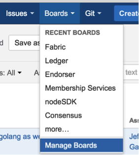
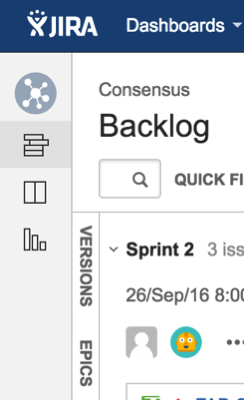

# Using Jira to understand current work items

This document has been created to give further insight into the work in progress
towards the hyperledger/fabric v1 architecture based off the community roadmap.
The requirements for the roadmap are being tracked in [Jira]( https://jira.hyperledger.org/).

It was determined to organize in sprints to better track and show a prioritized
order of items to be implemented based on feedback received. We’ve done this via
boards.
To see these boards and the priorities click on **Boards** -> **Manage Boards**:

Now on the left side of the screen click on **All boards**:

On this page you will see all the public (and restricted) boards that have been
created. If you want to see the items with current sprint focus, click on the
boards where the column labeled **Visibility** is **All Users** and the column
**Board type** is labeled **Scrum**. For example the **Board Name** Consensus:

When you click on Consensus under **Board name** you will be directed to a page
that contains the following columns:

The meanings to these columns are as follows:

*	Backlog – list of items slated for the current sprint (sprints are defined in
  2 week iterations), but are not currently in progress
*	In progress – are items currently being worked by someone in the community.
*	In Review – waiting to be reviewed and merged in Gerritt
*	Done – merged and complete in the sprint.

If you want to see all items in the backlog for a given feature set click on the
stacked rows on the left navigation of the screen:

This shows you items slated for the current sprint at the top, and all items in
the backlog at the bottom. Items are listed in priority order.

If there is an item you are interested in working on, want more information or
have questions, or if there is an item that you feel needs to be in higher
priority, please add comments directly to the Jira item. All feedback and help
is very much appreciated.
